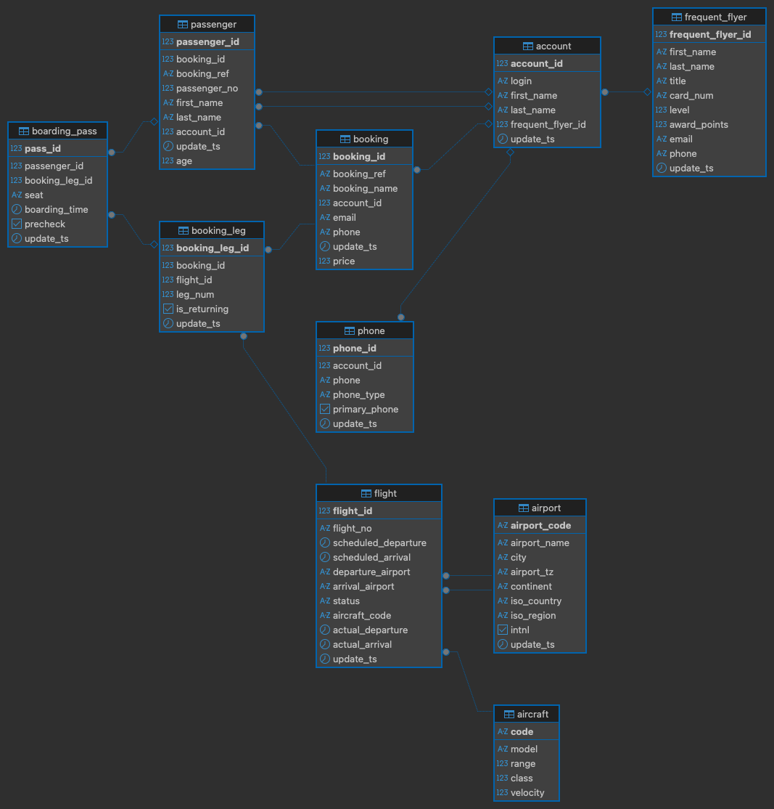

Chapter 1, titled "Why Optimize?", establishes the fundamental importance and scope of query optimization within the context of PostgreSQL database development.

# Setup
- Download the **postgres_air_2023.sql** dump file is located at [https://www.terabox.app/sharing/link?surl=WsSo7blyhLy6f9deLnc2XQ](https://www.terabox.app/sharing/link?surl=WsSo7blyhLy6f9deLnc2XQ)
- Extract zip file and place the **postgres_air_2023.sql** file into the `chap01/docker/data` directory.
- Initialize the database using the provided Docker Compose setup and seed the database with sample data.
  ```bash
  make setup
  ```

# DB Diagram


# Summary of Key Knowledge Points

The main knowledge points covered in this chapter include:

### 1. Defining Optimization and the Core Challenge

- **Definition:** Optimization is defined broadly as **any transformation that improves system performance**. The central philosophy advocated is that optimization should be an **integrated part of query development**, urging developers to write queries correctly from the start rather than trying to optimize poorly written queries later.
- **Thinking Like a Database:** Effective optimization requires understanding how a database engine processes a query and how the query planner selects an execution path. Developers are advised to "Think like a database".
- **The Difficulty of Optimization:** Optimization is necessary because **SQL is a declarative language**. When writing SQL, developers describe the _result_ they want, but do not specify the precise _sequence of steps_ the database should take to obtain that result. Conversely, imperative languages specify the steps. Due to this declarative nature, two queries that produce the identical result may **drastically differ in execution time**. The source material contrasts writing an imperatively constructed query (focusing on a sequence of steps) with writing a declarative query that allows the database optimizer to decide the best order of operations.

### 2. Optimization Goals and Scope

- **Varying Goals:** While fast execution time is often the primary goal, the definition of "good enough" performance varies significantly based on context (e.g., completion within an hour for a ledger versus completion in milliseconds for a web application function).
- **Metrics Beyond Time:** Optimization goals may also focus on maximizing **system throughput** or minimizing **resource utilization**.
- **SMART Goals:** Optimization goals should be defined using the **SMART goal framework** (Specific, Measurable, Achievable, Result-based, Time-bound).
- **Scope:** Overall **system performance** is the metric that matters to the end user. A SQL query should not be optimized in isolation; determining the business intent is a critical optimization step.
- **System Types:** The chapter introduces the distinction between optimizing queries for **OLTP** (Online Transaction Processing) systems and **OLAP** (Online Analytical Processing) systems. These map to the concepts of **short queries** and **long queries**.

### 3. Optimization Stages

- **Starting Point:** Optimization should ideally begin during the phases of **requirements gathering and database design**. Database design choices significantly influence performance. The source material illustrates how the intended usage of data determines whether a single-table or two-table database design is optimal.
- **Application Performance:** Optimization efforts must extend to **application development**, as overall application response time (which users experience) can be slow even if individual database queries are fast. Optimization should address process deficiencies outside the traditional scope of database tuning.
- **Continuous Process:** Optimization is not a one-time event; it is a **continuous process** throughout the application lifecycle, requiring monitoring of performance trends and adapting to changes in data volume or distribution.

### 4. PostgreSQL Specifics

- **Execution Plans:** Unlike systems like Oracle, PostgreSQL **does not cache queries**; it only caches data in shared buffers. Consequently, PostgreSQL **generates a new execution plan** every time a query is executed.
- **Declarative Writing:** Given the sophistication of the PostgreSQL optimizer, it is crucial to write SQL statements **declaratively** to allow the optimizer to choose the optimal execution strategy.
- **Parameter Impact (A Preview):** While configuration parameters are often the initial focus of "tuning," the book suggests that their impact on performance is generally **overrated** compared to techniques like query rewriting or indexing.
